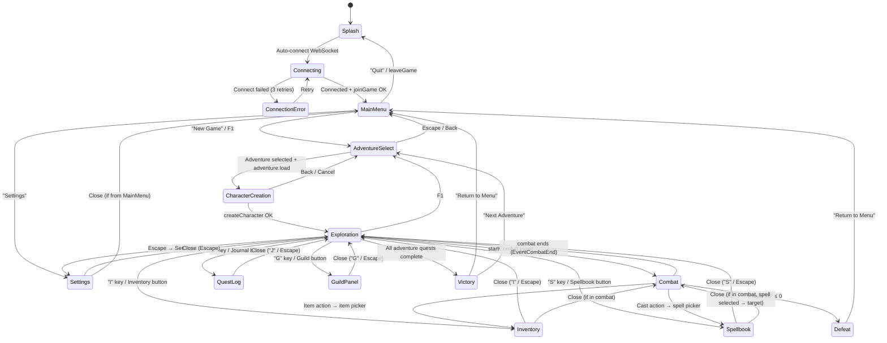

# CLIENT_SPEC.md — GoldBox RPG Engine UI/UX Requirements Specification

**Version:** 1.0  
**Date:** 2026-03-16  
**Status:** Specification — ready for implementation  
**Audience:** Frontend developers implementing the Ebitengine/WASM client

---

## Table of Contents

1. [Overview](#1-overview)
2. [Screen Flow Diagram](#2-screen-flow-diagram)
3. [Screen Specifications](#3-screen-specifications)
4. [Character Creation Flow](#4-character-creation-flow)
5. [Combat UI](#5-combat-ui)
6. [Inventory & Equipment](#6-inventory--equipment)
7. [Quest & Journal System](#7-quest--journal-system)
8. [Guild & Faction Panel](#8-guild--faction-panel)
9. [HUD & Persistent Elements](#9-hud--persistent-elements)
10. [Asset Requirements](#10-asset-requirements)
11. [Win/Loss Conditions](#11-winloss-conditions)
12. [Accessibility & Settings](#12-accessibility--settings)
13. [RPC Method Coverage Matrix](#13-rpc-method-coverage-matrix)

---

## 1. Overview

### Purpose

This document specifies the complete UI/UX requirements for the GoldBox RPG Engine's browser-based frontend client. It serves as the sole reference an implementer needs — together with the JSON-RPC API documentation in `pkg/README-RPC.md` and `RPC_QUICK_REFERENCE.md` — to build a fully functional game client from scratch.

### Target Platform

| Property | Value |
|----------|-------|
| Runtime | Browser — WebAssembly (Go → WASM via `GOOS=js GOARCH=wasm`) |
| Rendering Engine | Ebitengine v2 (`github.com/hajimehoshi/ebiten/v2`) |
| Canvas Size | 800 × 600 pixels (logical); `Layout()` adapts to browser window |
| Tile Grid | 32 × 32 pixels per tile |
| Target FPS | 60 (Ebitengine default) |

### Communication Protocol

| Property | Value |
|----------|-------|
| Protocol | JSON-RPC 2.0 over WebSocket |
| Endpoint | `ws[s]://{host}/rpc/ws` — derived from page `location` |
| Auth | Session-based — `joinGame` returns `session_id`; all subsequent calls include it |
| Notifications | Server pushes plain-JSON game events (non-JSON-RPC) via the same socket |
| Timeouts | Request: 30 s; Connection: 10 s with 3 retries (2 s, 4 s, 6 s back-off) |
| Reconnection | Automatic reconnection with exponential back-off on disconnect |

### Existing Implementation Reference

The current WASM client lives in `pkg/wasmui/` with entry point `cmd/wasm-ui/main.go`. Key source files:

| File | Responsibility |
|------|---------------|
| `game.go` | Ebitengine `Game` impl — `Update()`, `Draw()`, `Layout()` |
| `rpc_client_wasm.go` | WebSocket JSON-RPC 2.0 client with pending-request tracking |
| `rpc_methods.go` | RPC method wrappers for all server endpoints |
| `types_game.go`, `types_ui.go`, `types_rpc.go` | Shared types: `PlayerState`, `CombatState`, `UIMode`, etc. |
| `screens.go` | Main menu and screen management |
| `adventure_screen.go` | Adventure selection list, load, and display |
| `character_creation.go` | Character creation wizard |
| `combat_screen.go` | Combat UI and turn handling |
| `exploration.go` | Dungeon exploration mode |
| `overlays.go` | Modal overlays (inventory, quest log, etc.) |
| `editor.go`, `map_editor.go`, `quest_editor.go` | Editor UIs (out-of-scope for gameplay client) |

---

## 2. Screen Flow Diagram



### ASCII Fallback

```
  ┌──────────┐   auto-connect    ┌────────────┐   joinGame OK   ┌──────────┐
  │  Splash  │──────────────────▶│ Connecting  │───────────────▶│ MainMenu │
  └──────────┘                   └────────────┘                 └──────────┘
                                       │ fail                     │  │
                                       ▼                     New Game │Settings
                                 ┌──────────────┐                │  │
                                 │ ConnectError  │──retry──┘      │  ▼
                                 └──────────────┘            ┌──────────┐
                                                             │ Settings │
        ┌────────────────────────────────────────────────────┘──────────┘
        ▼
  ┌─────────────────┐  adventure.load  ┌─────────────────────┐  createCharacter
  │ AdventureSelect │────────────────▶│ CharacterCreation   │──────────┐
  └─────────────────┘                  └─────────────────────┘          │
                                                                       ▼
  ┌─────────┐  startCombat  ┌───────────┐                    ┌─────────────┐
  │ Defeat  │◀──HP≤0───────│  Combat   │◀───────────────────│ Exploration │
  └─────────┘               └───────────┘ ──EventCombatEnd──▶└─────────────┘
       │                         │  │                          │ │ │ │
       ▼                    cast/item                    I  S  J  G  Esc
  ┌──────────┐              │  │                          │ │ │ │  │
  │ MainMenu │         ┌────┘  └────┐                     ▼ ▼ ▼ ▼  ▼
  └──────────┘         ▼            ▼               ┌───────────────────────┐
                 ┌───────────┐┌───────────┐         │ Inventory / Spellbook │
                 │ Spellbook ││ Inventory │         │ QuestLog / GuildPanel │
                 └───────────┘└───────────┘         │ Settings              │
                                                    └───────────────────────┘
  ┌─────────┐
  │ Victory │──▶ MainMenu / AdventureSelect
  └─────────┘
```

### UI Mode Mapping

| UIMode constant | Screen(s) |
|----------------|-----------|
| `ModeNormal` | Exploration, MainMenu, Splash, Victory, Defeat |
| `ModeCombat` | Combat |
| `ModeInventory` | Inventory & Equipment |
| `ModeSpellcasting` | Spellbook / Spell Picker |
| `ModeAdventureSelect` | Adventure Selection |
| `ModeCharacterCreation` | Character Creation |

> **Note:** `QuestLog`, `GuildPanel`, and `Settings` are overlay screens drawn on top of the current mode and should be tracked via additional state flags (e.g., `showQuestLog bool`, `showGuildPanel bool`, `showSettings bool`) rather than new `UIMode` values, preserving the underlying mode for return.

---

## 3. Screen Specifications

### 3.1 Splash / Title Screen

**Purpose:** Branding display while the WASM binary loads and the WebSocket connects.

**Layout (800 × 600):**

```
┌──────────────────────────────────────────┐
│                                          │
│          GOLDBOX RPG ENGINE              │  ← centered, large font
│          ─────────────────               │
│                                          │
│          [Loading... / Connected]        │  ← status indicator
│          ▓▓▓▓▓▓▓▓░░░░░░░░  50%          │  ← progress bar (optional)
│                                          │
│          Press any key to continue       │  ← after connected
│                                          │
│     v1.0  ·  © opd-ai  ·  MIT License   │
└──────────────────────────────────────────┘
```

| Element | Position | Size |
|---------|----------|------|
| Title text | Centered horizontally, Y: 180 | — |
| Status text | Centered, Y: 300 | — |
| Progress bar | Centered, Y: 330 | 300 × 16 px |
| Prompt text | Centered, Y: 400 | — |
| Version/credits | Centered, Y: 560 | — |

**Interactions:**
- Automatic: triggers `rpcClient.Connect()` and `rpcClient.JoinGame("Player1")` on load
- Any key press or click after connection → transition to MainMenu
- On connection failure after retries → show error with retry button

**RPC Methods:** `joinGame`

**Refresh Triggers:** Connection state callbacks (`onConnected`, `onDisconnect`, `onError`)

---

### 3.2 Main Menu

**Purpose:** Central hub for starting games, accessing settings, and exiting.

**Layout (800 × 600):**

```
┌──────────────────────────────────────────┐
│                                          │
│          GOLDBOX RPG ENGINE              │
│                                          │
│         ┌──────────────────┐             │
│         │   New Game       │   ← F1     │
│         ├──────────────────┤             │
│         │   Continue       │   ← (grayed if no save) │
│         ├──────────────────┤             │
│         │   Settings       │             │
│         ├──────────────────┤             │
│         │   Quit           │             │
│         └──────────────────┘             │
│                                          │
│     Connection: ●  Connected             │
└──────────────────────────────────────────┘
```

| Element | Bounds | Interaction |
|---------|--------|-------------|
| "New Game" button | Centered, 200 × 40 px | Click or Enter → AdventureSelect |
| "Continue" button | Below, 200 × 40 px | Click → resume saved session (grayed if none) |
| "Settings" button | Below, 200 × 40 px | Click → Settings overlay |
| "Quit" button | Below, 200 × 40 px | Click → `leaveGame`, return to Splash |
| Connection indicator | Bottom-right, 12 px dot | Green = connected, Red = disconnected |

**Keyboard:** Arrow Up/Down to navigate menu items; Enter to select; F1 → New Game; Escape → Quit

**RPC Methods:** `leaveGame` (on Quit), `getGameState` (to check for resumable session)

---

### 3.3 Adventure Selection Screen

**Purpose:** Browse and select from available adventure packs before character creation.

**Mode:** `ModeAdventureSelect`

**Layout (800 × 600):**

```
┌──────────────────────────────────────────┐
│  ADVENTURE SELECT                  [ESC] │ ← header bar
├────────────────────────┬─────────────────┤
│                        │                 │
│  ▶ Mines of Madness    │  Title: Mines.. │ ← detail panel
│    Dragon's Lair       │  Theme: dungeon │
│    Forest of Whispers  │  Level: 1-5     │
│    ...                 │  Maps: 6        │
│                        │  Quests: 4      │
│                        │  Est: 3 hrs     │
│                        │                 │
│                        │  Description:   │
│                        │  Deep beneath   │
│                        │  the forgotten  │
│                        │  mountains...   │
│                        │                 │
├────────────────────────┴─────────────────┤
│  [Enter] Load   [R] Refresh   [Esc] Back│
└──────────────────────────────────────────┘
```

| Element | Bounds | Detail |
|---------|--------|--------|
| Adventure list | Left panel: 0–400 × 40–520 | Scrollable list with highlight on selected |
| Detail panel | Right panel: 400–800 × 40–520 | Shows `AdventureSummary` fields |
| Footer controls | 0–800 × 550–600 | Key hints |

**Data Source:** `AdventureSummary` struct fields: `ID`, `Slug`, `Title`, `Description`, `Theme`, `MinLevel`, `MaxLevel`, `EstHours`, `MapCount`, `QuestCount`

**Interactions:**
| Input | Action |
|-------|--------|
| Up / Down arrows | Navigate adventure list |
| Enter | Load selected adventure → `adventure.load` → CharacterCreation |
| R | Refresh list (2 s cooldown) |
| Escape | Return to MainMenu |
| Mouse click on list item | Select adventure |
| Mouse double-click | Select + Load |

**RPC Methods:** `adventure.list`, `adventure.load`

**Refresh Triggers:** On screen enter, on R key press

---

### 3.4 Character Creation Screen

**Purpose:** Create a new player character with name, class, and attributes.

**Mode:** `ModeCharacterCreation`

**Layout (800 × 600):**

```
┌──────────────────────────────────────────┐
│  CREATE YOUR CHARACTER                   │
├──────────────────────────────────────────┤
│                                          │
│  Name: [________________]                │ ← text input field
│                                          │
│  Class:                                  │
│  ┌────────┐ ┌────────┐ ┌────────┐       │
│  │Fighter │ │ Mage   │ │ Cleric │       │
│  └────────┘ └────────┘ └────────┘       │
│  ┌────────┐ ┌────────┐ ┌────────┐       │
│  │ Thief  │ │ Ranger │ │Paladin │       │
│  └────────┘ └────────┘ └────────┘       │
│                                          │
│  Proficiencies:                          │
│  Weapons: sword, axe, mace, bow, ...    │
│  Armor: light, medium, heavy             │
│  Shield: Yes                             │
│                                          │
│  Attributes:  Method: [Roll ▼]           │
│  ┌──────────────────────────────┐        │
│  │ STR: 14  DEX: 12  CON: 13  │        │
│  │ INT: 10  WIS: 11  CHA:  9  │        │
│  └──────────────────────────────┘        │
│  [Re-roll]                    [Confirm]  │
│                                          │
├──────────────────────────────────────────┤
│  [Esc] Cancel                [Enter] OK  │
└──────────────────────────────────────────┘
```

See **Section 4** for the detailed character creation flow.

**RPC Methods:** `createCharacter`

---

### 3.5 Exploration Screen

**Purpose:** Main gameplay — navigate the world, interact with objects/NPCs, trigger events.

**Mode:** `ModeNormal` (with `currentAdventure` set)

**Layout (800 × 600):**

```
┌──────────────────────┬───────────────────┐
│                      │  CHARACTER  [200px]│
│    MAP VIEWPORT      │  ─────────────    │
│    (568 × 350 px)    │  Name: Aldric     │
│                      │  Lv 3 Fighter     │
│    32px tile grid    │  HP: ████░░ 24/36 │
│                      │  AP: ●● (2/2)     │
│    Player centered   │                   │
│    "P" marker        │  STR:16  DEX:12   │
│                      │  CON:14  INT:10   │
│                      │  WIS:11  CHA: 9   │
│                      │                   │
│                      │  Pos: (14, 22)    │
│                      │  ──────────       │
│                      │  MINIMAP          │
│                      │  ┌──────────┐     │
│                      │  │ · · ·P· ·│     │
│                      │  │ ·██· · · │     │
│                      │  └──────────┘     │
├──────────────────────┤  Active Effects:  │
│  COMBAT LOG / MSG    │  🔥 Burning (3t) │
│  ──────────────────  │                   │
│  > Moved north       ├───────────────────┤
│  > Found a chest     │  QUEST TRACKER    │
│  > Goblin appears!   │  ● Kill 3 goblins│
│                      │    [2/3]          │
├──────────────────────┴───────────────────┤
│  [↖][↑][↗]  [Attack][Cast][Item][End]   │
│  [←]   [→]                   [I][S][J][G]│
│  [↙][↓][↘]                              │
└──────────────────────────────────────────┘
```

| Panel | Position | Size (px) | Content |
|-------|----------|-----------|---------|
| Map Viewport | Top-left | 600 × 350 | Tile grid, player, NPCs, objects |
| Character Panel | Top-right | 200 × 450 | Stats, HP/AP bars, attributes, minimap, effects, quest tracker |
| Combat Log | Mid-left | 600 × 150 | Scrollable message history |
| Action Panel | Bottom | 800 × 100 | Direction pad, action buttons, mode buttons |

**Map Viewport Details:**
- Grid: `(600 / 32) × (350 / 32)` = 18 × 10 visible tiles
- Player always centered; map scrolls around player
- Tiles rendered from terrain data per `getGameState` world response
- NPCs/objects rendered at their world positions relative to camera
- Fog of war: tiles beyond line-of-sight rendered dark
- Tile types: Floor, Wall, Door, Water, Lava, Pit, Stairs (from `TileType` constants)

**Interactions:**
| Input | Action | RPC Method |
|-------|--------|------------|
| W / ↑ / Numpad 8 | Move north | `move` (direction: "north") |
| S / ↓ / Numpad 2 | Move south | `move` (direction: "south") |
| A / ← / Numpad 4 | Move west | `move` (direction: "west") |
| D / → / Numpad 6 | Move east | `move` (direction: "east") |
| Q / Numpad 7 | Move northwest | `move` (direction: "northwest") |
| E / Numpad 9 | Move northeast | `move` (direction: "northeast") |
| Z / Numpad 1 | Move southwest | `move` (direction: "southwest") |
| C / Numpad 3 | Move southeast | `move` (direction: "southeast") |
| I | Toggle Inventory overlay | — |
| S (with Shift) | Toggle Spellbook overlay | — |
| J | Toggle Quest Log overlay | — |
| G | Toggle Guild Panel overlay | — |
| F1 | Open Adventure Select | — |
| Escape | Settings overlay | — |
| Space | End turn (if in combat context) | `endTurn` |
| Click on tile | Inspect tile / interact | `getObjectsInRadius` |
| Click on NPC | Interact / dialogue | — |

**RPC Methods Consumed:**
- `move` — on directional input
- `getGameState` — periodic refresh (default 5 s) and after each action
- `getObjectsInRange` / `getObjectsInRadius` / `getNearestObjects` — viewport population and spatial queries
- `findPath` — pathfinding preview (show path on right-click target tile)
- `getActiveQuests` — quest tracker HUD
- `getEquipment` — character panel display

**Refresh Triggers:**
- Every 5 seconds (periodic `getGameState`)
- After each movement/action
- On WebSocket notification (server push event)

---

### 3.6 Combat Screen

**Purpose:** Turn-based tactical combat on the tile grid.

**Mode:** `ModeCombat`

**Layout (800 × 600):**

```
┌──────────────────────┬───────────────────┐
│                      │ INITIATIVE   [200] │
│   COMBAT VIEWPORT    │ ─────────────     │
│   (600 × 350 px)    │ ▶ 1. Aldric   [P] │ ← current turn marker
│                      │   2. Goblin A     │
│   32px grid with     │   3. Goblin B     │
│   range/LOS overlay  │   4. Skeleton     │
│                      │ Round: 3          │
│   Movement range     │ ─────────────     │
│   highlighted blue   │ ACTIVE CHARACTER  │
│                      │ HP: ████░░ 24/36  │
│   Attack range       │ AP: ●● (2/2)     │
│   highlighted red    │ Effects:          │
│                      │  🛡️ Shield (2t)   │
│   Target cursor      │  🔥 Burning (1t)  │
├──────────────────────┤                   │
│  COMBAT LOG          │ TARGET INFO       │
│  ──────────────────  │ Goblin A          │
│  > Aldric attacks!   │ HP: ██░░░ 8/20   │
│  > 12 damage dealt   │ AC: 14            │
│  > Goblin A stunned  │ Effects: Stunned  │
├──────────────────────┴───────────────────┤
│ [Move][Attack][Cast][Use Item][End Turn] │
│  AP: 2/2    Status: YOUR TURN            │
└──────────────────────────────────────────┘
```

See **Section 5** for full combat UI specification.

**RPC Methods:** `move`, `attack`, `castSpell`, `useItem`, `applyEffect`, `startCombat`, `endTurn`, `getGameState`, `getObjectsInRadius`, `findPath`

---

### 3.7 Inventory & Equipment Screen

**Purpose:** View and manage carried items and equipped gear.

**Mode:** `ModeInventory`

See **Section 6** for full specification.

**RPC Methods:** `equipItem`, `unequipItem`, `getEquipment`, `useItem`, `getGameState`

---

### 3.8 Spellbook Screen

**Purpose:** Browse known spells, prepare spells, and select spell for casting.

**Mode:** `ModeSpellcasting`

**Layout (800 × 600):**

```
┌──────────────────────────────────────────┐
│  SPELLBOOK                        [ESC]  │
├──────────┬──────────────┬────────────────┤
│ FILTERS  │ SPELL LIST   │ SPELL DETAIL   │
│          │              │                │
│ Level:   │ ● Fireball   │ FIREBALL       │
│ [0][1].. │   Magic Mis  │ Level: 3       │
│ [9]      │   Shield     │ School: Evoc.  │
│          │   Cure Light │ Range: 120 ft  │
│ School:  │   Bless      │ Duration: Inst │
│ [Abjur.] │   Haste      │ Components:V,S │
│ [Conjur.]│   ...        │ Area: Yes      │
│ [Evoc.]  │              │ Save: DEX      │
│ ...      │              │                │
│          │              │ Damage: 8d6    │
│ Search:  │              │ Type: Fire     │
│ [______] │              │                │
│          │              │ A bright streak│
│          │              │ flashes from.. │
│          │              │                │
├──────────┴──────────────┤ [Cast] [Cancel]│
│ Known: 12  Slots: 4/6  │                │
└─────────────────────────┴────────────────┘
```

| Panel | Bounds | Content |
|-------|--------|---------|
| Filter panel | 0–120 × 40–560 | Level buttons (0–9), school filter, search box |
| Spell list | 120–420 × 40–560 | Scrollable list of spells matching filters |
| Spell detail | 420–800 × 40–560 | Selected spell info from `Spell` struct |
| Footer | 0–800 × 560–600 | Known count, slot count, Cast/Cancel buttons |

**Interactions:**
| Input | Action |
|-------|--------|
| Up/Down | Navigate spell list |
| Click on level/school filter | Filter spell list |
| Type in search box | Filter by text (`searchSpells`) |
| Enter / Click "Cast" | Select spell for casting → if in combat, switch to targeting mode |
| Escape | Close spellbook, return to previous mode |

**RPC Methods:** `getSpell`, `getSpellsByLevel`, `getSpellsBySchool`, `getAllSpells`, `searchSpells`, `castSpell` (on cast confirmation)

**Data Displayed:**
- Spell fields: `Name`, `Level`, `School` (mapped from `SpellSchool` enum), `Range`, `Duration`, `Components` (Verbal/Somatic/Material), `Description`, `DamageType`, `DamageDice`, `HealingDice`, `AreaEffect`, `SaveType`, `EffectKeywords`
- Schools: Abjuration, Conjuration, Divination, Enchantment, Evocation, Illusion, Necromancy, Transmutation

---

### 3.9 Quest Log Screen

**Purpose:** View active, completed, and failed quests with objective progress.

See **Section 7** for full specification.

**RPC Methods:** `getQuestLog`, `getActiveQuests`, `getCompletedQuests`, `getQuest`

---

### 3.10 Guild & Faction Panel

**Purpose:** Manage guild membership and view faction diplomacy.

See **Section 8** for full specification.

**RPC Methods:** All 12 guild methods + all 10 faction methods.

---

### 3.11 Settings Screen

**Purpose:** Configure game settings (accessibility, audio, display).

**Layout:** Modal overlay centered on screen, 500 × 400 px.

```
┌───────────────── SETTINGS ───────────────┐
│                                          │
│  Display                                 │
│    Text Size:  [Small] [Medium] [Large]  │
│    Color Mode: [Normal] [Protanopia]     │
│                [Deuteranopia] [Tritanopia]│
│                                          │
│  Audio                                   │
│    Music:       [████████░░] 80%         │
│    SFX:         [██████░░░░] 60%         │
│    Mute All:    [ ]                      │
│                                          │
│  Controls                                │
│    Keyboard Map: [Default]               │
│                                          │
│              [Save]  [Cancel]            │
└──────────────────────────────────────────┘
```

**Interactions:** Arrow keys / mouse to navigate; Enter to toggle; Escape to close.

**RPC Methods:** None (client-side only)

---

## 4. Character Creation Flow

### Step-by-Step Sequence

```
Step 1: Name Entry
  └─▶ Step 2: Class Selection (preview proficiencies)
       └─▶ Step 3: Attribute Generation (choose method)
            └─▶ Step 4: Review & Confirm
                 └─▶ RPC: createCharacter → Exploration
```

### Step 1 — Name Entry

| Element | Detail |
|---------|--------|
| Prompt | "Enter your character's name:" |
| Input field | Text box, 1–30 chars, alphanumeric + spaces |
| Validation | Non-empty; trim whitespace; reject special chars |
| Navigation | Tab / Enter → Step 2; Escape → back to AdventureSelect |

### Step 2 — Class Selection

Display a 3 × 2 grid of class cards:

| Class | Hit Dice | Key Proficiencies |
|-------|----------|-------------------|
| **Fighter** | d10 | All weapons; all armor; shields |
| **Mage** | d4 | Staff, dagger, wand; no armor; no shields |
| **Cleric** | d8 | Mace, staff, dagger; all armor; shields; no edged weapons |
| **Thief** | d6 | Dagger, sword, bow; light armor; no shields |
| **Ranger** | d8 | Bow, sword, dagger, spear; light/medium armor; shields |
| **Paladin** | d10 | Sword, mace, spear, bow, dagger; all armor; shields |

Each card shows:
- Class name and icon (from character portrait assets)
- Hit dice
- Weapon proficiencies list
- Armor proficiencies list
- Shield proficiency (Yes/No)
- Restrictions (if any)
- Minimum attribute requirements

**Interaction:** Click or arrow keys to select; highlighted card shows full proficiency detail in side panel; Enter to confirm.

### Step 3 — Attribute Generation

Four methods available (selectable via dropdown/tabs):

| Method | Identifier | Description |
|--------|-----------|-------------|
| **Roll** | `"roll"` | 4d6 drop lowest for each attribute; "Re-roll" button for new set |
| **Standard Array** | `"standard"` | Fixed array \[15, 14, 13, 12, 10, 8\]; assign to attributes |
| **Point Buy** | `"pointbuy"` | 27 points; costs vary by score (8=0, 9=1, … 15=9) |
| **Custom** | `"custom"` | Direct input of values (for testing/debug) |

**Display:** Six attribute fields (STR, DEX, CON, INT, WIS, CHA) showing current values. Modifier shown in parentheses, e.g., `STR: 16 (+3)`.

**Calculated preview:** HP preview = Hit Dice max + CON modifier; AC preview = 10 + DEX modifier.

**Interaction:**
- Roll: click "Re-roll" to generate new set
- Standard: drag-and-drop or click to assign scores to attributes
- Point Buy: +/- buttons on each attribute; remaining points counter
- Custom: direct numeric input

### Step 4 — Review & Confirm

**Display summary:**
```
┌──────────────────────────────────────┐
│  CHARACTER SUMMARY                   │
│                                      │
│  Name:     Aldric the Bold           │
│  Class:    Fighter                   │
│  Method:   Roll                      │
│                                      │
│  STR: 16 (+3)    DEX: 12 (+1)       │
│  CON: 14 (+2)    INT: 10 (+0)       │
│  WIS: 11 (+0)    CHA:  9 (-1)       │
│                                      │
│  HP: 12           AC: 11            │
│  Hit Dice: d10                       │
│                                      │
│  Weapons: sword, axe, mace, bow...   │
│  Armor: light, medium, heavy         │
│  Shield: Yes                         │
│                                      │
│       [◀ Back]        [Create ▶]     │
└──────────────────────────────────────┘
```

**On "Create" click:**

1. Send RPC call:
   ```json
   {
     "method": "createCharacter",
     "params": {
       "name": "Aldric the Bold",
       "class": "fighter",
       "attribute_method": "roll"
     }
   }
   ```
2. On success: store returned `session_id` and `character` data; transition to Exploration
3. On error: display error message; remain on creation screen

---

## 5. Combat UI

### Combat Entry

Combat begins when the server emits `EventCombatStart` (event type 100) via WebSocket notification, or in response to a `startCombat` RPC call. The client transitions from `ModeNormal` to `ModeCombat`.

### Initiative Tracker

**Position:** Right panel, top section (200 × 150 px)

```
INITIATIVE ORDER — Round 3
─────────────────────────
▶ 1. Aldric       [P] 18
  2. Goblin Archer     15
  3. Skeleton          12
  4. Goblin Chief      10
  5. Zombie             6
```

**Data Source:** `CombatState.Initiative` array of `InitiativeEntry` structs  
**Fields:** `ID`, `Name`, `Initiative` value, `IsPlayer` flag  
**Visual:** Current turn highlighted with `▶` marker and bright text color. Player entries tagged `[P]`. Dead entities shown struck-through or dimmed.

**Refresh:** On `EventTurnStart` / `EventTurnEnd` notifications, and after `endTurn` response.

### Turn Indicator

**Position:** Bottom action bar, right side

When it is the player's turn:
```
═══ YOUR TURN ═══  AP: 2/2
```

When it is not the player's turn:
```
Waiting... Goblin Archer's turn
```

**Data Source:** `CombatState.CurrentTurn` compared to `PlayerState.ID`

### Action Panel

**Position:** Bottom bar (800 × 100 px)

```
┌──────────────────────────────────────────────────────────────────┐
│  [Move] [Attack] [Cast Spell] [Use Item] [End Turn]            │
│  AP: ●● 2/2                             YOUR TURN               │
│  Selected: Attack → Click target on grid                         │
└──────────────────────────────────────────────────────────────────┘
```

**Action Buttons:**

| Button | Hotkey | Cost | Behavior | RPC Method |
|--------|--------|------|----------|------------|
| Move | M / Click empty tile | 1 AP | Highlight reachable tiles (blue); click tile to move | `move` with direction or `findPath` + sequential `move` |
| Attack | A / Click hostile | 1 AP | Highlight attackable targets (red); click target | `attack` with `target_id`, `weapon_id` |
| Cast Spell | C | 1 AP | Open spell picker (Spellbook overlay); select spell → target | `castSpell` with `spell_id`, `target_id`, `position` |
| Use Item | U | Varies | Open item picker (Inventory overlay); select item → target | `useItem` with `item_id`, `target_id` |
| End Turn | Space / Enter | 0 | End current turn | `endTurn` |

Buttons grayed out when:
- Not player's turn
- Insufficient AP
- Invalid in current state (e.g., no items, no spells known)

### Grid-Based Targeting

When an action requiring a target is selected:

1. **Move mode:** Highlight reachable tiles in blue based on remaining AP. Use `findPath` to compute and display path preview (dotted line from player to cursor).
2. **Attack mode:** Highlight hostile entities within attack range in red. Show attack range overlay.
3. **Spell mode:** Highlight valid target area based on spell range. If `AreaEffect` is true, show area-of-effect template on hover.

**Targeting cursor:** Yellow/orange highlight on the hovered tile. Confirm target with left-click; cancel with right-click or Escape.

### Effect & Condition Display

**Position:** Right panel, below initiative tracker and character stats

```
ACTIVE EFFECTS
──────────────
🔥 Burning      3 rounds    (from Fireball)
🛡️ Shield       5 rounds    (+2 AC)
💚 Regeneration 4 rounds    (+3 HP/round)
⚡ Haste        2 rounds    (+1 AP)
```

**Effect types displayed:** All `EffectType` constants — `damage_over_time`, `heal_over_time`, `poison`, `burning`, `bleeding`, `stun`, `root`, `stat_boost`, `stat_penalty`, `haste`, `slow`, `regeneration`, `paralysis`

**Icons mapping:**

| Effect | Icon | Color |
|--------|------|-------|
| Burning | 🔥 | Orange |
| Poison | ☠️ | Green |
| Bleeding | 🩸 | Dark Red |
| Stun | ⚡ | Yellow |
| Root | 🌿 | Brown |
| Stat Boost | ⬆️ | Blue |
| Stat Penalty | ⬇️ | Red |
| Haste | 💨 | Cyan |
| Slow | 🐌 | Gray |
| Regeneration | 💚 | Green |
| Paralysis | ❄️ | Ice Blue |
| Heal over Time | 💖 | Pink |
| Damage over Time | 💀 | Purple |

### Animation Triggers

Visual effects triggered by WebSocket event notifications:

| Event | Animation |
|-------|-----------|
| `EventCombatStart` | Screen flash; initiative roll animation |
| `EventCombatEnd` | Fade combat overlay; display victory/loot summary |
| `EventTurnStart` | Highlight active combatant; pulse initiative entry |
| `EventTurnEnd` | Dim current; advance initiative marker |
| `EventMovement` | Smooth tile-to-tile movement animation (4 frames) |
| Attack hit | Slash effect on target tile; damage number popup |
| Attack miss | "Miss" text popup; whoosh effect |
| Spell cast | Spell-specific VFX from combat effect assets |
| Effect applied | Icon flash + float-up text ("+Burning 3 rounds") |
| Entity death | Fade-out animation; remove from initiative |

### Combat RPC Flow (Player Turn)

```
1. EventTurnStart notification → enable action buttons
2. Player clicks [Attack] → attack mode
3. Player clicks target on grid
4. Client sends: attack(session_id, target_id, weapon_id)
5. Server returns: { success, damage, target_health, message }
6. Client: animate attack, update log, update target HP
7. AP decremented; if AP > 0, repeat from 2
8. Player clicks [End Turn] → endTurn(session_id)
9. Server returns: { success, next_turn }
10. If next_turn != player → disable buttons, await EventTurnStart
```

---

## 6. Inventory & Equipment

### Mode

`ModeInventory` — triggered by pressing "I" or clicking the Inventory button.

### Layout (800 × 600)

```
┌──────────────────────────────────────────┐
│  INVENTORY & EQUIPMENT            [ESC]  │
├────────────────────┬─────────────────────┤
│  EQUIPMENT SLOTS   │  INVENTORY BAG      │
│                    │                     │
│     ┌────┐         │  ┌────┬────┬────┐   │
│     │Head│         │  │Heal│Swrd│Ring│   │
│     └────┘         │  │Pot │+1  │Prt │   │
│  ┌────┐  ┌────┐    │  ├────┼────┼────┤   │
│  │Neck│  │Chest│   │  │Scrl│Axe │Gold│   │
│  └────┘  └────┘    │  │ FB │    │Amlt│   │
│  ┌────┐  ┌────┐    │  ├────┼────┼────┤   │
│  │Hand│  │Ring │    │  │Key │Bow │Shld│   │
│  └────┘  └────┘    │  │   │    │   │   │
│  ┌────┐  ┌────┐    │  └────┴────┴────┘   │
│  │Legs│  │Feet│    │  Page 1/3 [◀][▶]    │
│  └────┘  └────┘    │                     │
│  ┌─────┐ ┌─────┐   │  Selected: Sword +1 │
│  │Main │ │ Off │   │  Type: Weapon        │
│  │Hand │ │Hand │   │  Damage: 1d8+1       │
│  └─────┘ └─────┘   │  Weight: 3 lbs       │
│                    │  Requires: Fighter,   │
│  Weight: 42/100 lb│   Ranger, Paladin,    │
│                    │   Thief               │
│                    │                      │
│                    │ [Equip] [Drop] [Use] │
├────────────────────┴─────────────────────┤
│  Gold: 1,250     [Sort] [Filter]         │
└──────────────────────────────────────────┘
```

### Equipment Slots

9 equipment slots rendered in a paperdoll-style arrangement:

| Slot Constant | Display Name | Position in Layout |
|--------------|--------------|-------------------|
| `SlotHead` | Head | Top center |
| `SlotNeck` | Neck | Left of chest |
| `SlotChest` | Chest | Center torso |
| `SlotHands` | Hands | Left of rings |
| `SlotRings` | Rings | Right of hands |
| `SlotLegs` | Legs | Lower left |
| `SlotFeet` | Feet | Lower right |
| `SlotWeaponMain` | Main Hand | Bottom left |
| `SlotWeaponOff` | Off Hand | Bottom right |

Each slot rendered as a 48 × 48 px box showing the equipped item icon (or empty placeholder).

### Interactions

| Input | Action | RPC Method |
|-------|--------|------------|
| Click inventory item | Select item; show detail | — |
| Click "Equip" (or drag to slot) | Equip selected item to appropriate slot | `equipItem` (item_id, slot) |
| Click equipped slot item | Select for detail / unequip option | — |
| Click "Unequip" (or drag from slot) | Remove item from slot to inventory | `unequipItem` (slot) |
| Click "Use" | Use consumable item | `useItem` (item_id, target_id) |
| Click "Drop" | Remove from inventory | — (client-side confirm, then server call) |
| Arrow keys | Navigate inventory grid | — |
| Escape / I | Close inventory | — |

### Class Proficiency Validation

When attempting to equip an item, the client should:

1. Check item type against character class proficiencies (from `ClassProficiencies`)
2. If **not proficient**: show warning toast: `"Your Fighter cannot equip wand (not proficient)"`
3. The server also validates via `equipItem` and returns an error if invalid
4. Proficient items shown with normal brightness; non-proficient items shown dimmed with a red "X"

**Proficiency reference:**

| Class | Weapons | Armor | Shield |
|-------|---------|-------|--------|
| Fighter | sword, axe, mace, bow, dagger, spear, hammer | light, medium, heavy | ✓ |
| Mage | staff, dagger, wand | — | ✗ |
| Cleric | mace, staff, dagger | light, medium, heavy | ✓ |
| Thief | dagger, sword, bow | light | ✗ |
| Ranger | bow, sword, dagger, spear | light, medium | ✓ |
| Paladin | sword, mace, spear, bow, dagger | light, medium, heavy | ✓ |

### Weight / Encumbrance

- Display: `"Weight: 42/100 lbs"` in equipment panel
- Weight limit derived from Strength attribute
- Overweight warning: yellow text; over-limit: red text, movement penalty indicator
- Data source: `getEquipment` response field `total_weight` and `bonuses`

### RPC Methods

- `getEquipment` — on screen open and after equip/unequip
- `equipItem` — equip item to slot
- `unequipItem` — remove from slot
- `useItem` — consume item
- `getGameState` — refresh full state

---

## 7. Quest & Journal System

### Layout (overlay, 600 × 450 px, centered)

```
┌───────────── QUEST LOG ─────────────────┐
│  [Active] [Completed] [Failed]   [ESC]  │ ← tab bar
├──────────────────┬──────────────────────┤
│  QUEST LIST      │  QUEST DETAIL        │
│                  │                      │
│  ▶ Kill Goblins  │  KILL THE GOBLINS    │
│    Find Artifact │  Status: Active      │
│    Escort NPC    │                      │
│                  │  "Clear the goblin   │
│                  │   camp east of the   │
│                  │   village..."        │
│                  │                      │
│                  │  OBJECTIVES:         │
│                  │  ☑ Kill 3 goblins    │
│                  │    [████████░░] 2/3  │
│                  │  ☐ Destroy camp      │
│                  │    [░░░░░░░░░░] 0/1  │
│                  │                      │
│                  │  REWARDS:            │
│                  │   💰 500 gold        │
│                  │   ⭐ 200 XP          │
│                  │   📦 Goblin Slayer   │
│                  │       (Sword)        │
├──────────────────┴──────────────────────┤
│  Active: 3   Completed: 7   Failed: 1   │
└──────────────────────────────────────────┘
```

### Tabs

| Tab | RPC Method | Data |
|-----|-----------|------|
| Active | `getActiveQuests` | `active_quests` array + `count` |
| Completed | `getCompletedQuests` | `completed_quests` array + `count` |
| Failed | `getActiveQuests` filtered by `QuestFailed` status (or separate query) | — |

### Quest Detail Fields

From `Quest` struct:

| Field | Display |
|-------|---------|
| `Title` | Header text |
| `Description` | Body text |
| `Status` | Badge: Active (green), Completed (gold), Failed (red) |
| `Objectives[]` | List with progress bars |
| `Objectives[].Description` | Objective text |
| `Objectives[].Progress` / `Objectives[].Required` | Progress bar and fraction |
| `Objectives[].Completed` | Checkbox (checked/unchecked) |
| `Rewards[]` | List with icons based on `Type`: "gold" → 💰, "exp" → ⭐, "item" → 📦 |
| `Rewards[].Value` | Numeric amount |
| `Rewards[].ItemID` | Item name lookup |

### Quest Tracker on HUD

A compact version shown in the Exploration screen's character panel (right side, bottom):

```
QUEST TRACKER
─────────────
● Kill 3 goblins [2/3]
● Find the artifact [0/1]
```

- Shows top 3 active quests' first incomplete objective
- Clicking the tracker opens the full Quest Log

### Interactions

| Input | Action |
|-------|--------|
| J | Toggle quest log overlay |
| Tab | Cycle tabs (Active → Completed → Failed) |
| Up/Down | Navigate quest list |
| Click on quest | Show detail in right panel |
| Escape | Close quest log |

### RPC Methods

- `getQuestLog` — full quest data on open
- `getActiveQuests` — active tab
- `getCompletedQuests` — completed tab
- `getQuest` — single quest detail refresh
- `startQuest` — initiated from dialogue/event (not directly from this UI)
- `completeQuest` — called by server when objectives met (UI shows completion animation)
- `updateObjective` — called contextually during gameplay
- `failQuest` — called by server on failure condition

---

## 8. Guild & Faction Panel

### Layout (overlay, 700 × 500 px, centered)

```
┌────────── GUILD & FACTIONS ──────────────┐
│  [Guild] [Members] [Factions]     [ESC]  │
├──────────────────────────────────────────┤
│                                          │
│  ┌─── GUILD TAB ──────────────────────┐  │
│  │  Guild: Knights of Valor            │  │
│  │  Level: 5    XP: 12,400/20,000     │  │
│  │  Treasury: 8,500 gold               │  │
│  │  Leader: Aldric                     │  │
│  │  Members: 8                         │  │
│  │                                     │  │
│  │  PERKS:                             │  │
│  │  ✓ Shared Storage                   │  │
│  │  ✓ Bonus Experience (+10%)          │  │
│  │  ✓ Discount Shop (-15%)             │  │
│  │  ○ Fast Travel (Level 7)            │  │
│  │                                     │  │
│  │  [Deposit] [Withdraw] [Leave Guild] │  │
│  └─────────────────────────────────────┘  │
│                                          │
└──────────────────────────────────────────┘
```

### Guild Tab

**Data Source:** `getGuild` / `getCharacterGuild` response

| Field | Display |
|-------|---------|
| `Name` | Guild name header |
| `Level` | Level badge |
| `Experience` | XP bar with current/next threshold |
| `Treasury` | Gold amount |
| `LeaderID` | Leader name (resolved from member list) |
| `Members` count | Member count |
| `Perks[]` | Checkmarked list of active perks; locked perks shown grayed with level requirement |

**Guild Actions:**

| Button | RPC Method | Condition |
|--------|-----------|-----------|
| Deposit | `guildDeposit` | Member of guild; has gold |
| Withdraw | `guildWithdraw` | Has `PermissionWithdraw` |
| Leave Guild | `leaveGuild` | Not guild leader |
| Create Guild | `createGuild` | Not in a guild |
| Transfer Leadership | `transferGuildLeader` | Is guild leader |

### Members Tab

```
┌─── MEMBERS ──────────────────────────────┐
│  Name          Rank        Contribution   │
│  ─────────────────────────────────────── │
│  Aldric        Guild Master    4,200      │
│  Elena         Officer         2,800      │
│  Thaddeus      Member          1,500      │
│  Brin          Recruit           300      │
│  ...                                      │
│                                          │
│  [Promote] [Demote] [Kick]              │
└──────────────────────────────────────────┘
```

**Member Actions:**

| Button | RPC Method | Permission Required |
|--------|-----------|-------------------|
| Promote | `promoteGuildMember` | `PermissionPromote` |
| Demote | `demoteGuildMember` | `PermissionDemote` |
| Kick | `kickGuildMember` | `PermissionKick` |

**Data Source:** `getGuild` response → `Members` map of `GuildMember` structs; rank names from `Ranks[]` array.

### Factions Tab

```
┌─── FACTION DIPLOMACY ────────────────────┐
│  Faction           Relation    Opinion    │
│  ────────────────────────────────────── │
│  Elven Court       Allied      +75  ███▓ │
│  Dwarven Hold      Friendly    +40  ██▓░ │
│  Shadow Guild      Hostile     -60  ░░▓▓ │
│  Dragon Cult       War         -90  ░░░█ │
│                                          │
│  Selected: Elven Court                   │
│  State: Allied    Trust: +65             │
│  Trade Treaty: Yes  Military Access: Yes │
│  Defensive Pact: Yes                     │
│                                          │
│  [Declare War] [Offer Peace]             │
│  [Propose Alliance] [Break Alliance]     │
│  [Sign Trade] [Send Gift]               │
└──────────────────────────────────────────┘
```

**Faction Actions:**

| Button | RPC Method | Condition |
|--------|-----------|-----------|
| Declare War | `declareWar` | Not already at war |
| Offer Peace | `offerPeace` | Currently at war |
| Accept Peace | `acceptPeace` | Peace offered by other faction |
| Propose Alliance | `proposeAlliance` | Friendly+ relation |
| Accept Alliance | `acceptAlliance` | Alliance proposed by other |
| Break Alliance | `breakAlliance` | Currently allied |
| Sign Trade | `signTrade` | Neutral+ relation |
| Send Gift | `sendDiplomaticGift` | Any non-war state |

**Diplomacy States (from `DiplomaticState`):**

| State | Color | Indicator |
|-------|-------|-----------|
| `war` | Red | ⚔️ |
| `hostile` | Dark Red | 👊 |
| `tense` | Orange | ⚠️ |
| `neutral` | Gray | — |
| `friendly` | Light Green | 🤝 |
| `allied` | Green | ⭐ |
| `vassal` / `suzerain` | Gold | 👑 |

**Data Source:** `FactionRelation` struct fields: `State`, `Opinion` (-100 to +100), `Trust` (-100 to +100), `TradeTreaty`, `MilitaryAccess`, `DefensivePact`, `History[]`

### RPC Methods (Guild)

`createGuild`, `getGuild`, `getCharacterGuild`, `joinGuild`, `leaveGuild`, `kickGuildMember`, `promoteGuildMember`, `demoteGuildMember`, `guildDeposit`, `guildWithdraw`, `listGuilds`, `transferGuildLeader`

### RPC Methods (Faction)

`getFactionRelation`, `getFactionRelations`, `declareWar`, `offerPeace`, `acceptPeace`, `proposeAlliance`, `acceptAlliance`, `breakAlliance`, `signTrade`, `sendDiplomaticGift`

---

## 9. HUD & Persistent Elements

These elements are visible across multiple screens (primarily Exploration and Combat).

### 9.1 HP / AP Bars

**Position:** Character panel, top section

```
HP: ████████░░░░ 24/36
AP: ●●○ 2/3
```

**HP Bar:**
- Width: 140 px (inside character panel)
- Color coding: > 50% = green `(50, 200, 50)`, 25–50% = yellow `(200, 200, 50)`, < 25% = red `(200, 50, 50)`
- Background: dark red `(60, 20, 20)`
- Numeric display: `current/max` right of bar

**AP (Action Points) Bar:**
- Filled dots for available; empty dots for spent
- Default: 2 AP per turn (`ActionPointsPerTurn = 2`)
- Costs: Move = 1, Attack = 1, Spell = 1 (`ActionCostMove`, `ActionCostAttack`, `ActionCostSpell`)

### 9.2 Minimap

**Position:** Character panel, mid-right area  
**Size:** 100 × 80 px  
**Content:**
- Simplified overhead view of explored area
- Player position marked with bright dot
- Walls shown as dark pixels; floors as medium pixels
- NPCs/enemies as colored dots (green = friendly, red = hostile)
- Unexplored area black

**Data Source:** World data from `getGameState` — terrain tiles surrounding player position. Use `getObjectsInRange` for nearby entity positions.

### 9.3 Action Log (Combat Log)

**Position:** Mid-left panel (below viewport, above action bar)  
**Size:** 600 × 150 px  
**Content:** Scrollable message history (most recent at bottom)

**Message Types and Colors:**

| MessageType | Color (RGBA) | Usage |
|------------|-------------|-------|
| `MessageInfo` | (220, 220, 220) | General actions, movement |
| `MessageWarning` | (255, 200, 0) | Retry warnings, low HP |
| `MessageError` | (255, 100, 100) | Failed actions, disconnections |
| `MessageCombat` | (200, 150, 255) | Damage, healing, combat events |
| `MessageSystem` | (150, 200, 255) | Connection status, session info |

**Behavior:**
- Max 100 messages in buffer (configurable via `maxLogMessages`)
- Auto-scroll to newest message
- Mouse wheel to scroll up through history
- Messages fed from: RPC responses, WebSocket notifications, client events

### 9.4 Active Effects / Buffs

**Position:** Character panel, below attributes  
**Display:** Compact icon + remaining duration

```
Active Effects:
🔥 3t  ☠️ 5t  🛡️ 2t
```

Each effect shows:
- Icon (see effect icon mapping in Section 5)
- Remaining duration in turns/rounds
- Tooltip on hover: full effect name, source, magnitude

**Data Source:** Fetched as part of `getGameState` character data or combat state.

### 9.5 Compass / Coordinates

**Position:** Character panel, below attributes  
**Display:** `Pos: (14, 22) Level: 1`

Shows player's current grid coordinates and dungeon level from `PlayerState.Position` (X, Y, Level fields).

### 9.6 Connection Status

**Position:** Top-right corner of screen  
**Size:** 95 × 16 px

| State | Color | Text |
|-------|-------|------|
| Connected | Green (50, 200, 50) | "Connected" |
| Disconnected | Red (200, 50, 50) | "Disconnected" |
| Reconnecting | Yellow (200, 200, 50) | "Reconnecting..." |

### 9.7 Error Display

**Position:** Top-center, overlay  
**Size:** 300 × 40 px  
**Background:** Semi-transparent red (150, 30, 30, 230) with red border  
**Duration:** 5 seconds auto-dismiss  
**Content:** Error message text from RPC failures or client errors

---

## 10. Asset Requirements

All assets defined in `game-assets.yaml` (521 total). Organized by screen usage:

### Asset Categories and Counts

| Category | Subgroups | Screen Usage |
|----------|-----------|-------------|
| **Character Portraits** | Fighter, Mage, Cleric, Thief, Ranger, Paladin (8 variants each × race/gender) | Character Creation, Character Panel, Guild Members |
| **Monsters** | Undead, Humanoid, Dragons, Magical Creatures, Beasts, Demons, Constructs | Combat Viewport, Bestiary |
| **Items** | Weapons, Armor, Consumables, Magic Items, Equipment | Inventory, Equipment Slots, Loot screens |
| **Terrain Tiles** | Dungeon, Outdoor, Special | Map Viewport (32 × 32 px per tile) |
| **Combat Effects** | Spell Effects, Combat Animations, Status Effects, Additional Spell Effects | Combat Viewport overlay |
| **UI Elements** | Buttons, Icons, Panels, Indicators, Decorative | All screens |

### Asset Path Structure

```
web/static/assets/sprites/
├── characters/portraits/     ← CharacterCreation, CharPanel
│   ├── fighter_*.png
│   ├── mage_*.png
│   ├── cleric_*.png
│   ├── thief_*.png
│   ├── ranger_*.png
│   └── paladin_*.png
├── monsters/                 ← Combat Viewport
│   ├── undead/
│   ├── humanoid/
│   ├── dragons/
│   ├── magical/
│   ├── beasts/
│   ├── demons/
│   └── constructs/
├── items/                    ← Inventory, Equipment
│   ├── weapons/
│   ├── armor/
│   ├── consumables/
│   ├── magic/
│   └── equipment/
├── terrain/                  ← Map Viewport
│   ├── dungeon/
│   ├── outdoor/
│   └── special/
├── effects/                  ← Combat Viewport overlay
│   ├── spells/
│   ├── combat/
│   ├── status/
│   └── additional/
└── ui/                       ← All screens
    ├── buttons/
    ├── icons/
    ├── panels/
    ├── indicators/
    └── decorative/
```

### Per-Screen Asset Usage

| Screen | Asset Types Used |
|--------|-----------------|
| Splash/Title | UI decorative, UI panels |
| MainMenu | UI buttons, UI decorative |
| AdventureSelect | UI panels, UI icons |
| CharacterCreation | Character portraits, UI buttons, UI panels |
| Exploration | Terrain tiles, character portraits, monster sprites, item icons, UI elements |
| Combat | Terrain tiles, character portraits, monster sprites, combat effects, spell effects, status effects, UI elements |
| Inventory | Item icons (weapons, armor, consumables, magic, equipment), UI panels |
| Spellbook | Spell effect icons, UI panels, UI icons |
| QuestLog | UI panels, UI icons |
| GuildPanel | Character portraits (member list), UI panels |
| Settings | UI panels, UI buttons |

### Asset Loading Strategy

1. **Critical assets** (UI chrome, buttons, panels): load during splash screen
2. **Terrain tiles**: load on adventure selection (based on adventure theme)
3. **Character portraits**: load on character creation
4. **Monster sprites, combat effects**: lazy-load on first combat encounter
5. **Item icons**: lazy-load on first inventory open
6. **Fallback**: solid-color rectangles if asset not found (current behavior uses `drawRect`)

### Asset Configuration

From `game-assets.yaml` global config:
- Output base: `web/static/assets/sprites`
- Image format: PNG
- Default seed: 42
- Style: "fantasy RPG pixel art, detailed, vibrant colors, medieval fantasy"

---

## 11. Win/Loss Conditions

### Victory

**Trigger:** All main quest objectives in the current adventure are completed (all `QuestObjective.Completed == true` for adventure's primary quests).

**Victory Screen:**

```
┌──────────────────────────────────────────┐
│                                          │
│           ⭐ VICTORY! ⭐                │
│                                          │
│    Adventure: Mines of Madness           │
│    Completed!                            │
│                                          │
│    ─────── SUMMARY ───────               │
│    Time Played:    2h 34m                │
│    Quests Complete: 4/4                  │
│    Enemies Defeated: 47                  │
│    Gold Earned: 3,250                    │
│    XP Earned: 8,400                      │
│    Level: 3 → 5                          │
│                                          │
│    ┌──────────────────────────┐          │
│    │  Return to Menu          │          │
│    ├──────────────────────────┤          │
│    │  Next Adventure          │          │
│    └──────────────────────────┘          │
│                                          │
└──────────────────────────────────────────┘
```

**Flow:**
1. `completeQuest` response for final quest triggers victory check
2. Client displays Victory overlay with animation (gold sparkle effect)
3. Summary statistics gathered from `getGameState` and quest log data
4. "Return to Menu" → MainMenu
5. "Next Adventure" → AdventureSelect

### Defeat

**Trigger:** Player character HP drops to 0 or below during combat.

**Defeat Screen:**

```
┌──────────────────────────────────────────┐
│                                          │
│           ☠️ DEFEAT ☠️                   │
│                                          │
│    Your adventurer has fallen...         │
│                                          │
│    Last Location: Goblin Cave, Level 2   │
│    Cause: Defeated by Goblin Chief       │
│                                          │
│    ┌──────────────────────────┐          │
│    │  Return to Menu          │          │
│    ├──────────────────────────┤          │
│    │  Try Again (reload save) │          │
│    └──────────────────────────┘          │
│                                          │
└──────────────────────────────────────────┘
```

**Flow:**
1. Combat event with player HP ≤ 0 triggers defeat state
2. Screen darkens with fade-to-black effect
3. Defeat overlay displays with cause of death
4. "Return to Menu" → `leaveGame` → MainMenu
5. "Try Again" → reload last save point (if persistence available)

### Return-to-Menu Flow

```
Victory/Defeat screen
  └── "Return to Menu" click
       └── leaveGame RPC call
            └── Clear local game state (player, combat, adventure)
                 └── Transition to MainMenu
                      └── Re-join with joinGame if continuing
```

---

## 12. Accessibility & Settings

### 12.1 Keyboard-Only Navigation

All UI screens must be fully navigable via keyboard alone:

| Context | Keys | Action |
|---------|------|--------|
| Menu screens | ↑↓ / Tab | Navigate between items |
| Menu screens | Enter | Activate selected item |
| Menu screens | Escape | Back / Cancel |
| Exploration | WASD / Arrows / Numpad | 8-directional movement |
| Combat | Tab | Cycle through targets |
| Combat | 1-5 | Quick-select action buttons |
| Overlays | Tab | Cycle through interactive elements |
| All | F1–F5 | Quick-access screens |
| All | Escape | Close overlay / open settings |

**Focus indicator:** Selected/focused UI element has a visible bright border (2 px, gold color).

**Key bindings reference:**

| Key | Function |
|-----|----------|
| I | Inventory |
| Shift+S | Spellbook |
| J | Quest Log / Journal |
| G | Guild Panel |
| F1 | Adventure Select |
| M | Map / minimap toggle |
| L | Log scroll toggle |
| Escape | Settings / Close overlay |
| Space | End Turn (combat) |
| Enter | Confirm / Interact |

### 12.2 Text Scaling

Three levels of text scaling to accommodate different displays and visual needs:

| Size | Scale Factor | Debug Print Size |
|------|-------------|-----------------|
| Small | 1.0× | Default `ebitenutil.DebugPrintAt` |
| Medium | 1.5× | Scaled text rendering |
| Large | 2.0× | Scaled text rendering |

Implementation: wrap all text rendering in a scale-aware function that applies the current text scale setting.

### 12.3 Color-Blind Modes

Four display modes:

| Mode | Modification |
|------|-------------|
| Normal | Default color palette |
| Protanopia | Red-shifted colors replaced with blue/yellow palette |
| Deuteranopia | Green-shifted colors replaced with blue/yellow palette |
| Tritanopia | Blue-shifted colors replaced with red/green palette |

**Key affected elements:**
- HP bar colors (green/yellow/red → adjusted per mode)
- Friendly/hostile NPC indicators (green/red → blue/orange or shape-based)
- Effect type colors
- Faction diplomacy indicators

**Implementation:** apply color transformation matrix to all game colors based on selected mode. Additionally, use **shape** and **pattern** differentiation (not just color) for critical indicators:
- Friendly = circle, Hostile = triangle, Neutral = square
- HP bar adds pattern overlay at threshold levels

### 12.4 Audio Toggle

| Setting | Range | Default |
|---------|-------|---------|
| Music Volume | 0–100% slider | 80% |
| SFX Volume | 0–100% slider | 60% |
| Mute All | Toggle | Off |

**Note:** Audio system is not yet implemented in the engine. These settings should be persisted client-side (localStorage) and applied when audio support is added.

### 12.5 Settings Persistence

All settings stored in browser `localStorage` with key prefix `goldbox_`:
- `goldbox_text_scale` — "small" / "medium" / "large"
- `goldbox_color_mode` — "normal" / "protanopia" / "deuteranopia" / "tritanopia"
- `goldbox_music_volume` — 0–100
- `goldbox_sfx_volume` — 0–100
- `goldbox_mute_all` — true / false
- `goldbox_keybindings` — JSON object of custom key bindings

---

## 13. RPC Method Coverage Matrix

The following table maps **every** RPC method defined in `pkg/server/constants.go` to the UI screen(s) that consume it. All 71 method constants are covered.

### Character Actions (5 methods)

| # | Method | Constant | Screens |
|---|--------|----------|---------|
| 1 | `move` | `MethodMove` | Exploration, Combat |
| 2 | `attack` | `MethodAttack` | Combat |
| 3 | `castSpell` | `MethodCastSpell` | Combat (via Spellbook), Exploration (out-of-combat casting) |
| 4 | `useItem` | `MethodUseItem` | Combat (via Inventory), Inventory, Exploration |
| 5 | `applyEffect` | `MethodApplyEffect` | Combat (internally triggered by spell/item results) |

### Combat Management (2 methods)

| # | Method | Constant | Screens |
|---|--------|----------|---------|
| 6 | `startCombat` | `MethodStartCombat` | Exploration → Combat transition |
| 7 | `endTurn` | `MethodEndTurn` | Combat |

### Game State (4 methods)

| # | Method | Constant | Screens |
|---|--------|----------|---------|
| 8 | `joinGame` | `MethodJoinGame` | Splash / Connecting |
| 9 | `leaveGame` | `MethodLeaveGame` | MainMenu (Quit), Defeat, Victory |
| 10 | `getGameState` | `MethodGetGameState` | Exploration (periodic), Combat, MainMenu (check session), all screens (refresh) |
| 11 | `createCharacter` | `MethodCreateCharacter` | Character Creation |

### Equipment (3 methods)

| # | Method | Constant | Screens |
|---|--------|----------|---------|
| 12 | `equipItem` | `MethodEquipItem` | Inventory & Equipment |
| 13 | `unequipItem` | `MethodUnequipItem` | Inventory & Equipment |
| 14 | `getEquipment` | `MethodGetEquipment` | Inventory & Equipment, Character Panel (HUD) |

### Quest Management (8 methods)

| # | Method | Constant | Screens |
|---|--------|----------|---------|
| 15 | `startQuest` | `MethodStartQuest` | Exploration (dialogue/event triggered), Quest Log (accepted quests) |
| 16 | `completeQuest` | `MethodCompleteQuest` | Quest Log (completion trigger), Victory |
| 17 | `updateObjective` | `MethodUpdateObjective` | Exploration (objective progress), Quest Log (progress update) |
| 18 | `failQuest` | `MethodFailQuest` | Quest Log (failure event), Defeat |
| 19 | `getQuest` | `MethodGetQuest` | Quest Log (detail view) |
| 20 | `getActiveQuests` | `MethodGetActiveQuests` | Quest Log (Active tab), HUD Quest Tracker |
| 21 | `getCompletedQuests` | `MethodGetCompletedQuests` | Quest Log (Completed tab) |
| 22 | `getQuestLog` | `MethodGetQuestLog` | Quest Log (full log on open) |

### Spell System (5 methods)

| # | Method | Constant | Screens |
|---|--------|----------|---------|
| 23 | `getSpell` | `MethodGetSpell` | Spellbook (detail view) |
| 24 | `getSpellsByLevel` | `MethodGetSpellsByLevel` | Spellbook (level filter) |
| 25 | `getSpellsBySchool` | `MethodGetSpellsBySchool` | Spellbook (school filter) |
| 26 | `getAllSpells` | `MethodGetAllSpells` | Spellbook (initial load) |
| 27 | `searchSpells` | `MethodSearchSpells` | Spellbook (search box) |

### Spatial Queries (3 methods)

| # | Method | Constant | Screens |
|---|--------|----------|---------|
| 28 | `getObjectsInRange` | `MethodGetObjectsInRange` | Exploration (viewport population), Combat (range check) |
| 29 | `getObjectsInRadius` | `MethodGetObjectsInRadius` | Exploration (click-to-inspect), Combat (AOE preview), Minimap |
| 30 | `getNearestObjects` | `MethodGetNearestObjects` | Exploration (proximity alerts), Combat (nearest target) |

### Pathfinding (1 method)

| # | Method | Constant | Screens |
|---|--------|----------|---------|
| 31 | `findPath` | `MethodFindPath` | Exploration (right-click path preview), Combat (movement range display) |

### Procedural Content Generation (7 methods)

| # | Method | Constant | Screens |
|---|--------|----------|---------|
| 32 | `generateContent` | `MethodGenerateContent` | Exploration (dynamic encounters) |
| 33 | `regenerateTerrain` | `MethodRegenerateTerrain` | Exploration (procedural area generation) |
| 34 | `generateItems` | `MethodGenerateItems` | Exploration (loot generation), Inventory (loot screen) |
| 35 | `generateLevel` | `MethodGenerateLevel` | Exploration (dungeon level generation) |
| 36 | `generateQuest` | `MethodGenerateQuest` | Exploration (procedural quest creation), Quest Log |
| 37 | `getPCGStats` | `MethodGetPCGStats` | Settings (debug info), Exploration (content stats) |
| 38 | `validateContent` | `MethodValidateContent` | Exploration (content integrity check, hidden from UI — called internally) |

### Guild Management (12 methods)

| # | Method | Constant | Screens |
|---|--------|----------|---------|
| 39 | `createGuild` | `MethodCreateGuild` | Guild Panel (Guild tab — no guild state) |
| 40 | `getGuild` | `MethodGetGuild` | Guild Panel (Guild tab) |
| 41 | `getCharacterGuild` | `MethodGetCharacterGuild` | Guild Panel (initial load — determine membership) |
| 42 | `joinGuild` | `MethodJoinGuild` | Guild Panel (guild list browse → join) |
| 43 | `leaveGuild` | `MethodLeaveGuild` | Guild Panel (Guild tab — leave action) |
| 44 | `kickGuildMember` | `MethodKickGuildMember` | Guild Panel (Members tab) |
| 45 | `promoteGuildMember` | `MethodPromoteGuildMember` | Guild Panel (Members tab) |
| 46 | `demoteGuildMember` | `MethodDemoteGuildMember` | Guild Panel (Members tab) |
| 47 | `guildDeposit` | `MethodGuildDeposit` | Guild Panel (Guild tab — treasury) |
| 48 | `guildWithdraw` | `MethodGuildWithdraw` | Guild Panel (Guild tab — treasury) |
| 49 | `listGuilds` | `MethodListGuilds` | Guild Panel (guild browser — no guild state) |
| 50 | `transferGuildLeader` | `MethodTransferGuildLeader` | Guild Panel (Members tab — leader only) |

### Faction Diplomacy (10 methods)

| # | Method | Constant | Screens |
|---|--------|----------|---------|
| 51 | `getFactionRelation` | `MethodGetFactionRelation` | Guild Panel (Factions tab — detail) |
| 52 | `getFactionRelations` | `MethodGetFactionRelations` | Guild Panel (Factions tab — list) |
| 53 | `declareWar` | `MethodDeclareWar` | Guild Panel (Factions tab — action) |
| 54 | `offerPeace` | `MethodOfferPeace` | Guild Panel (Factions tab — action) |
| 55 | `acceptPeace` | `MethodAcceptPeace` | Guild Panel (Factions tab — action) |
| 56 | `proposeAlliance` | `MethodProposeAlliance` | Guild Panel (Factions tab — action) |
| 57 | `acceptAlliance` | `MethodAcceptAlliance` | Guild Panel (Factions tab — action) |
| 58 | `breakAlliance` | `MethodBreakAlliance` | Guild Panel (Factions tab — action) |
| 59 | `signTrade` | `MethodSignTrade` | Guild Panel (Factions tab — action) |
| 60 | `sendDiplomaticGift` | `MethodSendDiplomaticGift` | Guild Panel (Factions tab — action) |

### Editor Methods (9 methods)

These methods serve the Map Editor and Quest Editor tools, not the gameplay client. They are included for completeness.

| # | Method | Constant | Screens |
|---|--------|----------|---------|
| 61 | `editor.createMap` | `MethodEditorCreateMap` | Map Editor (`web/editor.html`) |
| 62 | `editor.updateTile` | `MethodEditorUpdateTile` | Map Editor |
| 63 | `editor.saveMap` | `MethodEditorSaveMap` | Map Editor |
| 64 | `editor.loadMap` | `MethodEditorLoadMap` | Map Editor |
| 65 | `questEditor.create` | `MethodQuestEditorCreate` | Quest Editor (`web/quest-builder.html`) |
| 66 | `questEditor.get` | `MethodQuestEditorGet` | Quest Editor |
| 67 | `questEditor.update` | `MethodQuestEditorUpdate` | Quest Editor |
| 68 | `questEditor.delete` | `MethodQuestEditorDelete` | Quest Editor |
| 69 | `questEditor.list` | `MethodQuestEditorList` | Quest Editor |

### Adventure Management (2 methods)

| # | Method | Constant | Screens |
|---|--------|----------|---------|
| 70 | `adventure.list` | `MethodAdventureList` | Adventure Selection |
| 71 | `adventure.load` | `MethodAdventureLoad` | Adventure Selection |

### Coverage Summary

```
Total RPC methods in constants.go:  71
Mapped to gameplay screens:          60  (methods 1–60, 70–71)
Mapped to editor tools:               9  (methods 61–69)
Unmapped:                              0

Screen coverage:
  Splash/Connecting:     1  method  (joinGame)
  MainMenu:              2  methods (leaveGame, getGameState)
  Adventure Selection:   2  methods (adventure.list, adventure.load)
  Character Creation:    1  method  (createCharacter)
  Exploration:          18  methods (move, castSpell, useItem, getGameState, spatial ×3,
                                     findPath, PCG ×7, startCombat, startQuest)
  Combat:               10  methods (move, attack, castSpell, useItem, applyEffect,
                                     endTurn, getGameState, spatial ×2, findPath)
  Inventory:             5  methods (equipItem, unequipItem, getEquipment, useItem, getGameState)
  Spellbook:             6  methods (getSpell, getSpellsByLevel, getSpellsBySchool,
                                     getAllSpells, searchSpells, castSpell)
  Quest Log:             8  methods (all quest methods)
  Guild Panel:          22  methods (12 guild + 10 faction)
  Victory/Defeat:        3  methods (completeQuest, failQuest, leaveGame)
  Settings:              1  method  (getPCGStats — debug)
  Editor tools:          9  methods (editor.* + questEditor.*)
```

### UIMode ↔ Screen Verification

| UIMode Constant | Has Screen Spec | Section |
|----------------|----------------|---------|
| `ModeNormal` | ✅ | §3.5 Exploration + §3.2 MainMenu |
| `ModeCombat` | ✅ | §3.6 / §5 Combat UI |
| `ModeInventory` | ✅ | §3.7 / §6 Inventory & Equipment |
| `ModeSpellcasting` | ✅ | §3.8 Spellbook |
| `ModeAdventureSelect` | ✅ | §3.3 Adventure Selection |
| `ModeCharacterCreation` | ✅ | §3.4 / §4 Character Creation |

**All 6 UIMode values have corresponding screen specifications.** ✅

### Character Lifecycle Verification

```
1. ✅ Connection    — Splash → joinGame
2. ✅ Adventure     — AdventureSelect → adventure.list / adventure.load
3. ✅ Creation      — CharacterCreation → createCharacter
4. ✅ Exploration   — move, getGameState, spatial queries
5. ✅ Combat        — startCombat → attack/cast/item → endTurn
6. ✅ Quests        — startQuest → updateObjective → completeQuest
7. ✅ Guild/Faction — createGuild, joinGuild, diplomacy
8. ✅ Equipment     — equipItem, unequipItem
9. ✅ Spells        — getAllSpells, castSpell
10.✅ Victory       — completeQuest → Victory screen
11.✅ Defeat        — HP ≤ 0 → Defeat screen
12.✅ Exit          — leaveGame → Splash/MainMenu
```

---

*End of CLIENT_SPEC.md*
